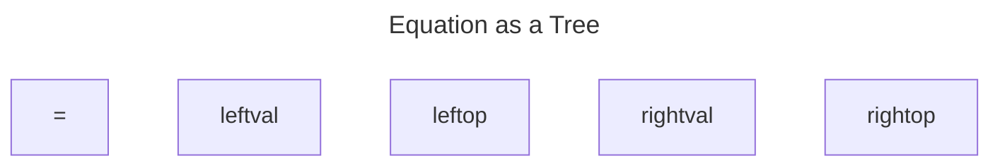

# Calgebra
An algebra library(?) in C


## Equation Structure


```
Original Equation:
(3x + 8y)^2 + x(3x + 11y) = -(2x + 7y)^2 - y(29y - 13x)
```



```mermaid
---
title: Equation as a Tree
---
flowchart TB
	head["="]

	leftval
	leftop

	rightval
	rightop
```